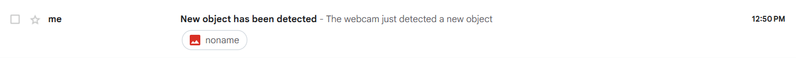

# 📹 MOTION2MAIL

## 🚀 DESCRIPTION
This is a Python application that monitors a webcam feed to detect motion. When motion is detected, it captures photograph of the moving object and sends a notification via email, along with the picture as attachment.

## 🌍 POSSIBLE APPLICATIONS
### **🏠 Home Security Monitoring**  
This system can be used as a lightweight home security solution to monitor entrances, rooms, or outdoor areas and notify users when unexpected motion is detected.

### **🏢 Office and Workspace Surveillance**  
Small offices and shared workspaces can use this project to track after-hours activity and receive alerts when movement occurs outside normal operating times.

### **🏬 Retail Store Monitoring**  
Retail environments can adapt this system to monitor restricted areas, storage rooms, or storefront activity during closed hours without deploying expensive surveillance systems.

### **🦌 Wildlife or Outdoor Observation**  
With minor adjustments, the application can be used to capture images of wildlife movement for research or observation purposes in outdoor or rural environments.

## ⚙️ MECHANISM
Motion2mail uses the OpenCV library to initialize webcam and stores the first frame for reference. Then it converts each frame to grayscale and applies Gaussian blur. It then checks for absolute differences betwewen the current and reference frame. Thresholding and dilation are applied to highlight motion. It ignores small movement but detects contours and draws a bounding rectangle around larger motions. It stores the image of the object per frame, naming them in order, in a folder called images. Then when the object is out of the frame, it selects a photo around the middle among all images from the images directory, sends it as an attachment via email and then cleans up the images folder.  

## ⚠️ DISCLAIMER
Ensure that the SMTP credentials are configured as environment variables on the system. The code will not work unless you configure your SMTP credentials in [emailing.py](emailing.py)

## 🎬 DEMO SCREENSHOTS

### Live Motion Detection


### Email Alert



## ▶️ INSTALLATION

### PREREQUISITES
- Python 3.6+
- Webcam
- Internet access (for sending the emails)

### Steps

**1. Clone the repository:**
```bash
git clone https://github.com/ostrichwoddy/Motion2mail.git
cd Motion2mail
```

**2. (Recommended) Create and activate a virtual environment:**
```
python -m venv venv
source venv/bin/activate      # Linux / macOS
venv\Scripts\activate         # Windows
```

**3. Install dependencies:**
```
pip install -r requirements.txt
```

**4. Configure email credentials:**
- Open emailing.py
- Set SMTP server details
- Configure sender and recipient email addresses
- Use an app password if required (for example, Gmail)

## 💻 USAGE
```
python main.py        # On some systems you might need to use python3 instead
```

## 🔷 CONTRIBUTION GUIDELINES

- Fork the repository.
-  Create a new branch for your change:
- Make changes.
- Test your changes locally before committing.
- Commit with a clear, concise message.
- Open a pull request explaining the changes made.l
  
Contributions will fall under the Apache 2.0 License.


## 📜 LICENSE

Licensed under the Apache License, Version 2.0.

You may obtain a copy of the License at:

    http://www.apache.org/licenses/LICENSE-2.0

Unless required by applicable law or agreed to in writing, software distributed under the License is distributed on an "AS IS" BASIS, WITHOUT WARRANTIES OR CONDITIONS OF ANY KIND, either express or implied.
For more details, check [LICENSE](LICENSE)
